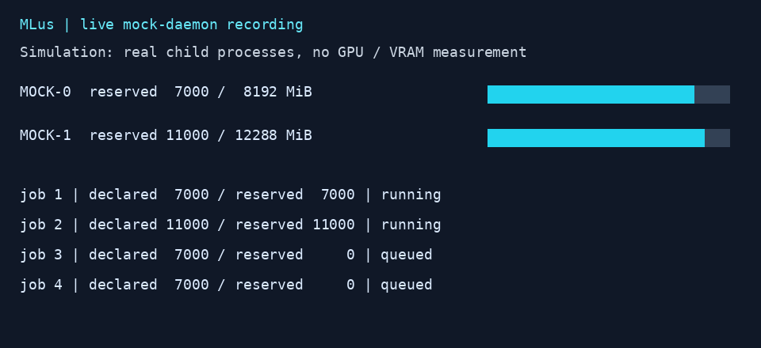
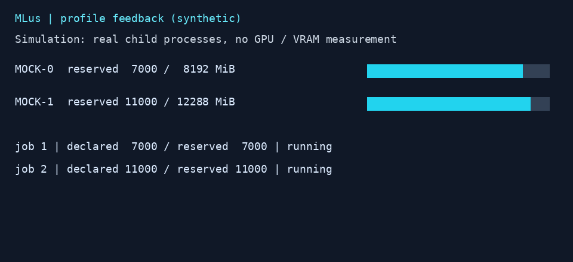
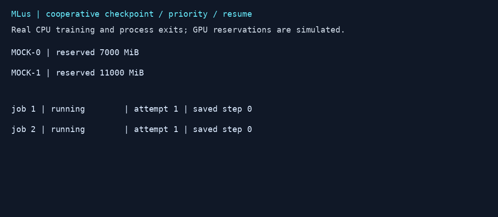
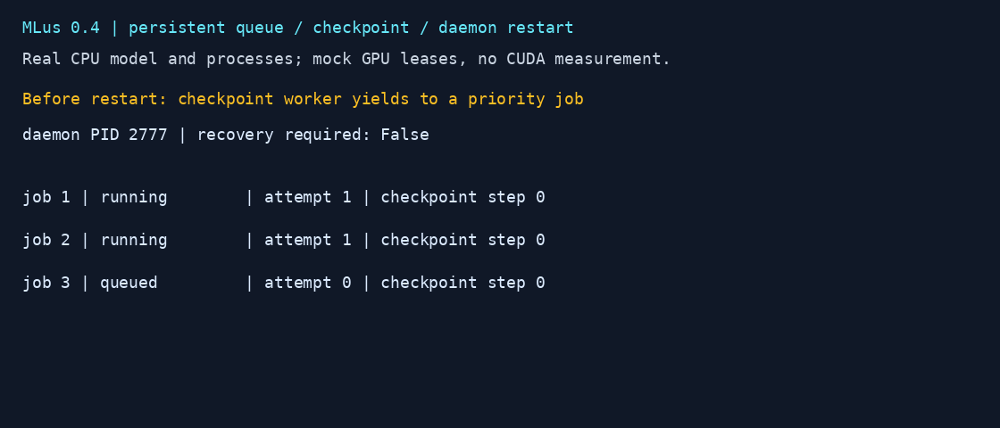
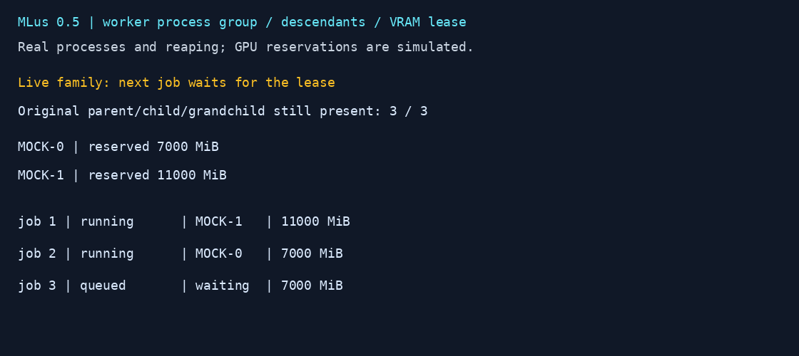

# MLus — Machine Learning Unix-like System

Rustで実装する、Linuxユーザー空間のMLリソース管理基盤です。現在はMVP 0.5で、モデルメモリプロファイル、チェックポイント再開、永続ジョブ台帳に加え、同じプロセスグループの子・孫プロセスの終了管理を実装しています。まず単一ホストのNVIDIA GPUを対象に、VRAM需要を申告したジョブを空き容量と予約台帳に基づいて配置します。独立OS、GPUドライバ、CUDAメモリアロケータは実装していません。



**デモは実際のモックデーモンと子プロセスを記録したGIFです。GPU計測ではありません。** 2台に配置 → 容量不足のジョブが待機 → 終了後に再開、を表示します。[元の観測データ](assets/demo-states.json)と[再生成スクリプト](scripts/demo.py)も公開しています。

## できること

- NVIDIA GPU UUID、VRAM使用量、使用率、GPUプロセスの監視（`nvidia-smi`経由）。
- 複数GPUからbest-fitで選択。`CUDA_VISIBLE_DEVICES`を子プロセスに設定。
- 申告VRAM + 安全余裕 + 実行中予約量に基づく起動可否判定。
- モデル/入力条件のキー・GPU UUIDごとのメモリプロファイル。実測ピークから次回の予約量を増やし、ディスクに永続化。
- 既存Pythonコードを実行するPyTorchプロファイリングラッパー（CUDA実機では未検証）。
- 優先度順・同優先度FIFOの待機列。容量回復時に未起動ジョブを自動実行。
- オプトインのチェックポイント→ワーカー終了→予約返却→同じGPUでの再起動。
- ジョブごとにプロセスグループを作成。子・孫プロセスの終了・回収を確認してから予約を返却。
- 待機列・履歴・attempt・ログの永続化。異常終了時は残存ワーカーの確認まで新規起動を停止。
- CLI、読み取り専用Webダッシュボード、JSON API、子プロセスのログと終了状態。
- GPU不要のモックと、同じスケジューラを使う決定的な比較シミュレーション。

通常ジョブの待機は初回起動までの待機です。`--cooperative`を指定したジョブは、アプリ自身がチェックポイントを保存して終了し、その状態を読み込む新しいワーカーとして再開できます。任意の実行中プロセスを透過的に中断する機能ではありません。

## インストール

Linux、Rust 1.90.0、Cargoが必要です。通常のRust導入は[公式rustup](https://rustup.rs/)を使用してください。Rustのバージョンは`rust-toolchain.toml`、依存関係は`Cargo.lock`で固定しています。

```bash
git clone https://github.com/rsasaki0109/mlus.git
cd mlus
cargo build --release --locked
# PATHに追加済みの任意のユーザー所有ディレクトリへ:
install -m 755 target/release/mlus "$HOME/.local/bin/mlus"
```

インストール先がなければ先に`mkdir -p "$HOME/.local/bin"`を実行してください。

## GPUなしで試す

```bash
cargo run --locked -- serve --mock
# 別のターミナルで、同じリポジトリから:
./target/debug/mlus submit --vram-mib 7000 -- python3 -c 'import time; time.sleep(5)'
./target/debug/mlus submit --vram-mib 11000 -- python3 -c 'import time; time.sleep(5)'
./target/debug/mlus submit --vram-mib 7000 --priority 5 -- python3 -c 'print("admitted")'
./target/debug/mlus status
```

デーモンは`127.0.0.1:8787`にのみbindします。ローカルブラウザで同ポートの`/`を開くとダッシュボードを確認できます。クラウドオンボーディングUI用のプレビューリンクはありません。`--port N`でポート、`serve --margin-mib N`で既定512 MiBの余裕を変更できます。`status`の`log_directory`内の`job-ID.log`に標準出力・標準エラーを保存します。

## NVIDIA / PyTorchで使う

NVIDIAドライバと`nvidia-smi`が必要です。CUDA・PyTorchはジョブ側の依存関係です。まず`nvidia-smi`を確認し、デーモンを**同じホスト・同じユーザー**で起動します。

```bash
./target/debug/mlus serve
# CUDA対応PyTorchをインストール済みのPythonを使う:
./target/debug/mlus submit --vram-mib 1024 -- python3 examples/torch_probe.py --mib 256
./target/debug/mlus status
```

既存コードも`mlus submit ... -- python3 /absolute/path/train.py`で起動できます。作業ディレクトリはその状態ディレクトリを最初に作ったデーモンのcwdを保存・使用します。Python環境・環境変数は現在のデーモンから継承し、秘密情報をジョブ台帳に保存しません。ジョブが必要とする環境でデーモンを起動するか、仮想環境のPythonやスクリプトを絶対パスで指定してください。CUDA_VISIBLE_DEVICES内では割り当てられた1台が`cuda:0`です。マルチGPU分散学習は未対応です。

## モデル別メモリプロファイル



このGIFも実モックデーモンの記録です。メモリ量は**明示的に生成した合成値**で、実GPU測定ではありません。最初の2ジョブからGPUごとのプロファイルを取り込み、次の2ジョブでは申告量7,000 MiBより大きな予約量を使用します。[記録データ](assets/profile-demo-states.json)。

GPUなしの動作確認:

```bash
./target/debug/mlus submit --vram-mib 7000 --profile demo:shape-fixed -- python3 examples/profile_simulation.py --peak-mib 7500
./target/debug/mlus status
```

本物のNVIDIA環境では、CUDA対応PyTorchを用意して次のように既存スクリプトを包みます。`--profile`のキーにはモデルversion、入力shape、batch size、dtype、学習/推論の違いを含めてください。

```bash
./target/debug/mlus submit --vram-mib 1024 --profile probe:256MiB:v1 -- python3 integrations/pytorch_profile.py examples/torch_probe.py --mib 256
```

GPU UUID別に`max(申告量, 観測reservedピーク + 128 MiB, OOM時の予約量 + 128 MiB)`を使います。未観測GPUでは申告量を使い、申告量を自動的に減らすことはありません。実行中ジョブの予約は変えず、待機中ジョブは新しいプロファイルで再評価します。

デーモンの`--state-dir PATH`（既定`.mlus-state`）内に保存し、同じディレクトリからの再起動で復元します。モックとCUDAのデータは別ファイルです。履歴ピークは将来の上限保証ではなく、CUDAコンテキストや他ライブラリのアロケーションもPyTorchのカウンタには含まれません。[報告仕様と制約](docs/profiling.md)を参照してください。

## 協調的なチェックポイント再開



**CPUモデルを実際に学習し、GPU予約だけをモックにした記録です。** 50ステップごとに状態を保存・終了し、高優先度ジョブへ予約を渡した後、4回のワーカー起動で200ステップを完了します。最終の重み・バイアスは中断なしの学習結果と一致しました。[元データ](assets/checkpoint-demo-states.json)。

```bash
MLUS_CHECKPOINT_DIR=$(mktemp -d)
./target/debug/mlus submit --cooperative --vram-mib 7000 --profile cpu-linear:fixed-shape -- python3 examples/checkpoint_train.py --checkpoint "$MLUS_CHECKPOINT_DIR/model.json"
./target/debug/mlus status
```

既存の学習コードでは、安全なステップ境界でモデル・optimizer・RNG・進行位置をアプリ側で保存し、`integrations/mlus_checkpoint.py`の`yield_checkpoint(...)`を呼びます。ワーカーと同じグループの子孫の終了・回収をデーモンが確認してから予約を返し、再起動時に`MLUS_CHECKPOINT_PATH`を渡します。自動的なstate抽出、任意プロセスのpreemption、GPU間migrationはありません。0.4では受理済みのチェックポイント待機状態をデーモン再起動後にも復元します。[契約と制約](docs/checkpoints.md)。

実CUDA向けには`examples/torch_checkpoint_train.py`を用意しています。CUDA環境でプロファイリングラッパーと組み合わせる例です。**この例の実GPU動作は未検証**です。

```bash
./target/debug/mlus submit --cooperative --profile tiny-linear:fp32:bs32:v1 --vram-mib 1024 -- python3 integrations/pytorch_profile.py examples/torch_checkpoint_train.py --checkpoint /absolute/path/to/new-checkpoint.pt
```

## ジョブ保存と再起動時の復旧



**実CPU学習とデーモン再起動を記録したGIFです。GPUはモックです。** チェックポイント待機中にデーモンを通常終了し、再起動後に同じジョブID・ログで残りの学習を完了します。[観測データ](assets/recovery-demo-states.json)。

同じ`--state-dir`で再起動すると、未起動ジョブと受理済みのチェックポイント待機ジョブを復元します。SIGINT/SIGTERMで終了した実行中ジョブは`cancelled`になり、自動再試行しません。

クラッシュ時に`starting`/`running`の記録がある場合は`interrupted`にし、**すべての新規起動を停止**します。`status`で確認し、残存ワーカーを実際に確認・終了した後に実行してください。

```bash
./target/debug/mlus status
# 残存ワーカーを確認・終了した後:
./target/debug/mlus recover --confirm-cleanup
```

保存されたPIDは履歴情報です。PID再利用の可能性があるため自動的にkillしません。`recover`は確認済みであることを明示する操作で、残存プロセスの検査・終了や中断ジョブの再実行は行いません。保存失敗時は`job_store_error`を表示し、新規起動を止めます。[保存順序、復旧手順、制約](docs/recovery.md)。

## 子・孫プロセスの終了管理



**実際の親・子・孫プロセスの終了を記録したGIFです。GPUはモックです。** 待機中の次ワーカー自身も、前ジョブの3つのPIDが回収済みであることを確認します。[観測データ](assets/process-demo-states.json)。

ジョブを専用のLinuxプロセスグループで起動します。ワーカー本体が終了した後は、同じグループの残存プロセスを終了・回収し、グループがなくなるまで予約を保持します。通常停止と異常終了時のcleanupにも同じ管理を使います。

`setsid`などでグループを離れた子孫がデーモンに引き取られた場合は、`status`の`process_management.escaped_children`に表示し、新規起動を止めます。残存プロセスを確認・終了するまで`recover`も拒否します。**cgroupによる隔離ではなく、離脱した全子孫を追跡できる保証はありません。** ジョブはグループを離れず、アプリ自身でも子をjoin・終了してください。[管理方式と制約](docs/processes.md)。

## 検証

```bash
cargo test --locked
cargo clippy --locked --all-targets -- -D warnings
cargo build --locked
python3 scripts/smoke.py
python3 scripts/profile_smoke.py
python3 scripts/checkpoint_smoke.py
python3 scripts/recovery_smoke.py
python3 scripts/process_smoke.py
python3 scripts/test_pytorch_wrapper.py
cargo run --locked --example sim_benchmark
cargo run --locked --example feedback_benchmark
# 任意: GIF再生成 (Pillowが必要)
python3 scripts/demo.py
python3 scripts/demo.py --profiles
python3 scripts/checkpoint_demo.py
python3 scripts/recovery_demo.py
python3 scripts/process_demo.py
```

現在の環境ではRust単体テスト14件と、実デーモン・実子プロセスを使う機能検証が成功しました。NVIDIAアダプタはCSVを返す実行ファイルfixtureで検証しています。依存不要の小さなCPU線形回帰モデルもモック予約下で学習を完了しました。**実GPU、CUDA、GPU上のMLモデル、実OOM、GPU性能改善は未検証**です。[検証結果と実機手順](docs/validation.md)を参照してください。

## 技術的制約

予約は協調的な申告に基づき、強制的なVRAM上限ではありません。外部プロセスの割当競合、申告不足、CUDAコンテキストや一時バッファによるOOMを防ぐ保証はありません。実GPUでは観測使用量に管理ジョブ分が含まれるため予約との二重計上があり、保守的に配置します。

透過的なVRAM移動、任意プロセス間のメモリ共有、CPUオフロード、GPU計算時間の隔離はありません。CUDA IPC・Unified Memory・PyTorchアロケータを汎用的な解決策と仮定しません。詳細は[設計](docs/architecture.md)と[競合調査](docs/research.md)に記載しています。

これは同一ユーザー向けのローカル開発用デーモンです。APIはコマンドを実行するため、共有ホストの認可境界として使用しないでください。POSTはローカルJSONクライアントに限定し、Origin付きブラウザ送信を拒否しますが、同一ホスト上の他ユーザーからのアクセスを隔離しません。ネットワークへ公開しないでください。

モデルプロファイル・ジョブ台帳・ログを状態ディレクトリに保存します。SIGINT/SIGTERMでは所有するジョブのグループを終了・回収します。クラッシュ時の残存プロセスを引き継いだり、履歴PIDを使って自動終了したりはしません。グループを離れる子孫、外部サービス、MPSなどの実行資源は隔離できません。ログ容量制限・ユーザー分離は今後の課題です。

## 次の段階

MLus 0.5は、GPU別の協調的メモリ報告・チェックポイント再開・永続ジョブ台帳を、子孫の終了確認と予約返却へつなげました。プロセスグループやsubreaper自体は既存のLinux技術です。申告不足を学んで次回の予約を増やせますが、合成データの検証だけで独自の性能優位を実証したとは扱いません。

次は実機でPyTorchラッパーと小型モデルを検証し、NVML直接バックエンド、cgroupへ委譲された環境での実行隔離、明示的なCPUオフロードを順に検討します。MPS/MIGなど既存の隔離基盤と競合する機能は再実装せず、必要に応じて組み合わせます。
